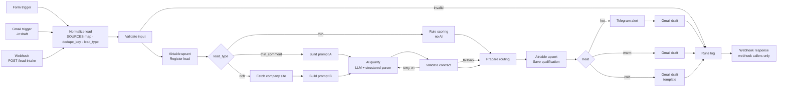

# Architecture

How the workflow is put together, what each branch produces, how the data is stored, and what happened
when it was tested. The short version is in the [README](../README.md).

## The graph



Thirty-seven nodes in the main workflow, four in the error workflow. The Code nodes are in
[`src/nodes/`](../src/nodes/), one file each, and `scripts/build_workflow.py` assembles the JSON.

## Three branches, one contract

The fork is not "B2B or B2C". It is how much data came in.

| `lead_type` | Signal | Who scores |
|---|---|---|
| `thin` | contact, channel and time, nothing else | a scoring rule, no LLM call |
| `thin_comment` | a comment or request text | the model, one narrow task: warmth and intent |
| `rich` | a company name or a corporate email domain | the model, full qualification and a reply draft, after a look at the public website |

Every branch returns the same JSON:

```json
{ "score": 0, "heat": "hot | warm | cold", "category": "string", "reason": "string, up to 200 chars",
  "draft": "string, may be empty", "needs_review": false }
```

The score is authoritative. The tier is recomputed from it (hot at 70 and above, warm from 40 to 69, cold
below 40) even if the model said otherwise. `needs_review` is set by the workflow, never by the model:
it becomes true when the model's answer failed validation three times, when the model call failed with a
status that must not be retried, or when enrichment failed.

`category` describes what the person wants, independent of how well they fit: a request for a price is
`purchase_intent` even when the score is low. The other values are `question`, `support`, `other`, and
`unclassified` for rule-scored leads.

### Rule scoring for thin leads

| Factor | Points |
|---|---|
| Channel: referral / form / email / phone / paid ads / unknown | 60 / 45 / 45 / 45 / 35 / 25 |
| Both phone and email present | +10 |
| Repeat contact (`touches` > 1) | +15 |
| Received in business hours | +5 |

Deliberately simple. On a call it is the argument that AI was put where it is needed and nowhere else.

### The two prompts

Prompt A (`thin_comment`) gets the channel, the contact and the message, and returns warmth and intent
with an empty draft. Prompt B (`rich`) also gets the company, the domain and the website extract, and
returns a full qualification against the ideal customer profile plus a reply draft in the company's tone.
Both prompts ask for JSON only and include an example of the exact output. On a retry, the previous
validation errors are appended to the system prompt.

Four layers protect the output: the format instruction with an example, n8n's Structured Output Parser with
a JSON schema, the workflow's own validator in `validate_contract.js` (required keys, enums, range,
score-versus-tier), and after the third rejected answer a fallback contract: score 50, warm,
`needs_review` true. The auto-fixing parser is switched off on purpose; it has known problems with fenced
JSON and block responses.

### Routing: decide first, then act

`Prepare routing` computes everything the side-effect nodes will need from a frozen table and touches
nothing itself. The nodes after it only execute.

| heat | CRM status | Telegram | Gmail |
|---|---|---|---|
| hot | Hot | alert | personal draft, in the thread for email leads, never sent |
| warm | Nurture | – | personal draft if the model wrote one, nurture template otherwise |
| cold | Archived | – | template reply as a draft |
| any, with `needs_review` | as above | alert | as above |

Phone-only leads skip Gmail. Nothing is sent automatically; turning the cold branch into a real auto-reply
is one operation change in that Gmail node.

## Airtable

Two tables. Field names are case-sensitive and Airtable silently ignores unknown fields, so they have to be
exact. `scripts/deploy.py --create-tables` creates both.

**Leads**. The primary field is `dedupe_key`, because Airtable does not allow an autonumber as primary.

| Field | Type | Notes |
|---|---|---|
| dedupe_key | Text | normalized email, else phone in E.164 |
| lead_id | Autonumber | |
| created_at, updated_at | Date and time | first contact, last update |
| source_channel | Single select | form_site, referral, ads_meta, ads_google, email_inbound, phone |
| lead_type | Single select | thin, thin_comment, rich |
| name, email, phone, company, domain | Text, Email, Phone, Text, Text | company and domain stay empty for B2C |
| message, enrichment | Long text | the request, and what the public site said |
| score | Number | 0 to 100 |
| heat | Single select | hot, warm, cold |
| category | Single select | purchase_intent, question, support, other, unclassified |
| reason, draft | Long text | one sentence for the manager; the draft that went to Gmail |
| status | Single select | New, Hot, Nurture, Contacted, Archived |
| touches | Number | how many times this contact reached out |
| needs_review | Checkbox | |
| run_id | Text | the n8n execution id, matches `Runs` |

**Runs**: `run_id`, `timestamp`, `trigger_source`, `lead_ref`, `status` (ok / retry / error),
`failed_node`, `error_message`, `duration_ms`. A row is written on every path, including invalid input,
fallbacks and crashes.

Both Airtable writes are the native "create or update" by `dedupe_key`. The first one registers the lead and
returns the stored row, which is how the previous `touches`, `created_at` and `status` come back without a
search node. The second one saves the qualification.

## Reliability

**Fallback model.** The chain node has two model sub-nodes. When the primary call throws, typically a 503
"high demand" from Google, the same call is repeated on the fallback model at once. Only if both fail does
the error reach the retry loop.

**Retry loops.** The two calls without side effects, the website fetch and the model call, sit in explicit
loops: classify the error, wait `min(20 s, 2 s × 2^(attempt−1))` plus a little jitter, try again, at most
three attempts. Retried: 408, 409, 425, 429, 500, 502, 503, 504. Never retried: 400, 401, 403, 404, 422.
n8n's own "retry on fail" is not used anywhere: it waits a fixed time and retries every error.

**Writers never retry.** Airtable, Telegram and Gmail nodes run with "continue on error" and no retries. A
retried write is a duplicate row or a duplicate draft.

**Error workflow.** Whatever still crashes is caught by `error-workflow.json`: one `Runs` row with the
failed node and the execution link, one Telegram alert. n8n only runs an error workflow that is itself
active; the deploy script activates it.

**Invalid input** never fails an execution. Webhook callers get a structured body back (`ok: false`, the
list of errors), and the run is logged.

## Test run

All cases were run on 2026-09-18 against n8n 2.39.5 with Gemini `gemini-3.5-flash-lite` and
`gemini-3.5-flash` as fallback, Telegram and Gmail connected.

| case | input | lead_type | score | heat | category | status | touches | review | Runs | Telegram | Gmail draft |
|---|---|---|---|---|---|---|---|---|---|---|---|
| 1 | webhook, referral, phone only | thin | 60 | warm | unclassified | Nurture | 1 | no | ok | – | – (no email) |
| 2 | webhook, "how much, next week" | thin_comment | 90 | hot | purchase_intent | Hot | 1 | no | ok | alert | personal draft |
| 3 | webhook, B2B from a corporate domain | rich | 35 | cold | purchase_intent | Archived | 1 | no | ok | – | template draft |
| 4 | webhook, same email as case 2 | thin_comment | 85 | hot | purchase_intent | Hot | 2 | no | ok | alert | draft |
| 5 | webhook, broken API key | thin_comment | 50 | warm | unclassified | Nurture | 1 | yes | error: AI qualify | review alert | nurture draft |
| 6 | the demo form | thin_comment | 75 | hot | purchase_intent | Hot | 1 | no | ok | alert | draft |
| 7 | an inbound email | thin_comment | 85 | hot | purchase_intent | Hot | 1 | no | ok | alert | draft in the sender's thread |

The error workflow was exercised separately with a throwaway workflow that throws on purpose: one `Runs`
row, one alert. Case 3 is cold by design: the company in the sample is far outside the demo's ideal
customer profile, the reason sentence says so, and the intent is still filed as `purchase_intent`.
